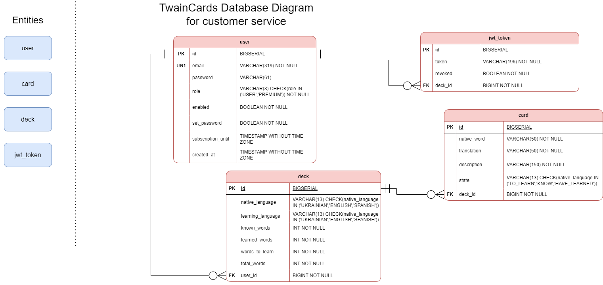

# Twaincards

TwainCards is an application that will help you to learn a new language or improve your vocabulary

## Tech Stack

- **Spring Boot**
- **Spring Security** (including a custom provider, JWT, Refresh Token, Google OAuth2, and logout service)
- **Spring Data JPA** (for data access and persistence)
- **JDBC Template** (for low-level database access)
- **PostgreSQL** (as the relational database)
- **PgAdmin** (for database management and administration)
- **Eureka Server** (for service discovery and load balancing)
- **RabbitMQ** (for message brokering)
- **SMTP** (for sending registration confirmation emails)
- **OkHttp library** (for sending API requests)


## Installation

Previously, install Docker from the [link](https://www.docker.com/products/docker-desktop/) and after use following commands


    
## Run Locally

Clone the project

```bash
  git clone https://github.com/n0rb33rt/TwainCards
```

Go to the project directory

```bash
  cd TwainCards-main
```

Containerize and run services

```bash
  docker-compose up -d
```


## Microservices Architecture


## Database Design


